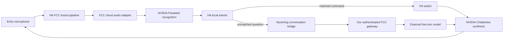

# FCC backup and Homeway switching

**FCC (`fcc-claude`) is the Homeway backup, with its own cloud audio path.** Home Assistant supports keeping both assistants connected. The FCC gateway, conversation bridge and cloud audio adapter run as three small services on the designated worker. Local Whisper/Piper remain stopped and excluded from the active deployment.



HA chooses one assistant per interaction; connecting FCC does not remove Homeway
or change an Echo's selection. The FCC pipeline uses NVIDIA cloud ASR/TTS through
our adapter and FCC for conversation. It does not call Homeway for speech.
See [cloud audio configuration and limits](fcc-cloud-audio.md).

The worker runs protocol services, not the recognition, synthesis or language
models. Audio is processed by NVIDIA, unmatched text reaches FCC's selected
external model, and answer text reaches NVIDIA for synthesis. HA local intents
remain preferred for supported household commands. The conversation bridge has
no HA token, home state, device tools, browsing, clock or conversation history;
it advertises `supports_home_control=false`.

The earlier **138-second** observation was local Whisper, not FCC cloud
recognition. That deferred experiment is retained only as
[historical evidence](fcc-local-speech-experiment.md). Its PVCs are preserved and
must not be deleted or restored automatically during FCC recovery.

## Audio boundary and model selection

The existing Homeway assistant uses Homeway cloud STT/TTS. Reusing those with the FCC conversation engine would be a Homeway-dependent hybrid. The implemented FCC pipeline instead uses its separate NVIDIA ASR/TTS adapter.

The inspected FCC HTTP routes remain text-oriented: selecting an audio model name does not add an audio endpoint to `/v1/messages`. FCC already has a provider-owned NVIDIA NIM/Riva Parakeet backend for messaging voice notes. The new HA adapter uses that same cloud recognition route with explicit Russian, bounded native async RPCs and complete-segment handling; it additionally supplies Russian Chatterbox synthesis. The existing NVIDIA credential succeeded in synthetic requests. See [exact audio routes and account limits](fcc-audio-models.md#existing-fcc-cloud-audio-backend). No local model or new provider account is required.

See [the catalog and audio route notes](fcc-audio-models.md). The supplied `~/fcc-models.txt` was inspected and left intact. The currently verified conversation route is:

```text
anthropic/open_router/liquid/lfm-2.5-2.6b:free
```

This route is text-only and currently has zero prompt/completion price. Its provider discloses prompt/output retention for training. The adjacent `no-thinking` alias failed with HTTP 400 because this endpoint requires reasoning; the bridge returns only final text. A free-tier Gemma route returned HTTP 429 and is not configured as a fallback. Catalog names do not guarantee working transport, unlimited capacity or a free account allowance. Never substitute a paid route silently.

## Deploy and recover the FCC services

Implementation lives in [`integrations/fcc-voice-backup/`](../integrations/fcc-voice-backup/): the conversation bridge, cloud-audio adapter, pinned dependencies/images, `k8s/gateway.yaml`, `k8s/bridge.yaml`, `k8s/cloud-speech.yaml` and optional network policies. No speech model download, local Whisper/Piper deployment or model PVC is required for this active scope. The operator maintains the reviewed placement and recovery copy with the deployment configuration.

```bash
docker build -t fcc-voice-bridge:0.1.1 integrations/fcc-voice-backup
```

The bridge manifest uses `imagePullPolicy: Never`. Import the image into the selected node's Kubernetes/containerd image store, or deliberately use a private-registry immutable digest and corresponding pull policy. Workstation/NAS Docker storage is separate from k3s/containerd. Keep scheduling pinned to the node with the imported image.

Namespace `homeassistant` and Secret `fcc-voice-credentials` must exist. For an initial deployment only, obtain the existing provider credential through your private secret store and create a separate proxy token without putting either in command arguments:

```bash
umask 077
mkdir -p private
# Populate private/openrouter-api-key from the existing secret store first.
python3 -c 'import secrets; from pathlib import Path; Path("private/fcc-proxy-token").write_text(secrets.token_urlsafe(36))'
kubectl -n homeassistant create secret generic fcc-voice-credentials \
  --from-file=openrouter-api-key=private/openrouter-api-key \
  --from-file=proxy-token=private/fcc-proxy-token
```

Preserve existing credentials during recovery. The gateway reads both; the bridge mounts only the proxy token. The pinned FCC gateway uses Bearer authentication and empty `MODEL_FALLBACKS`. The bridge accepts explicit FCC OpenRouter `:free` IDs; that suffix is not a billing guarantee. The existing shared FCC deployment is untouched. Cloud speech has a separate `fcc-cloud-speech-credentials` Secret containing only the existing NVIDIA key; see the cloud-audio guide for its image and credential mount.

Apply only the reviewed gateway, bridge, cloud-audio service and accepted gateway-ingress policy with your private scheduling overlay. TCP readiness proves a listening process, not provider quota or complete voice capability. In HA, register the bridge through **Settings → Devices & services → Add integration → Wyoming Protocol**, host `fcc-voice-bridge.homeassistant.svc.cluster.local`, port `10400`. Register `fcc-cloud-speech.homeassistant.svc.cluster.local:10500` as a second Wyoming integration for FCC STT/TTS. HA outside the cluster needs private reachable addresses. The Echo connects to HA, not to cluster DNS directly. Neither registration requires restarting HA.

All services are internal ClusterIP. Wyoming is unauthenticated. The gateway ingress policy was verified to allow bridge pods and deny an unrelated ordinary pod; missing proxy credentials were rejected. The optional bridge policy blocked the actual HA host-network path despite exact-source exceptions and is not deployed. Therefore the conversation and audio Wyoming listeners trust cluster clients and are not claimed to be network-isolated. Do not blindly apply `network-policy.yaml` in full or reintroduce a rejected bridge policy during recovery. No public Ingress or NodePort is required.

## Switch one or several satellites


Keep both Homeway and FCC registered. Select FCC only after checking the complete pipeline described in the cloud-audio guide. The CLI refuses missing/unavailable engines, but registered entity availability is not proof of provider quota or current inference health. Homeway remains the selected primary until an operator deliberately changes a satellite.

The simple UI route is each satellite's **Assistant** select: choose **FCC Russian Backup** to use the standby, or the existing Homeway assistant to return. Choosing HA's global preferred pipeline alone does not override a satellite with an explicit assistant selection. No APK reinstall, firmware update, wake-word retraining or USB connection is needed.

For repeatable switching use [`scripts/voice_pipeline.py`](../scripts/voice_pipeline.py). Use Python 3.11 with `aiohttp` installed; the bridge requirements provide a tested version:

```bash
python3.11 -m venv private/voice-tools
private/voice-tools/bin/pip install -r integrations/fcc-voice-backup/requirements.txt
cp templates/home-assistant/voice-backends.example.json private/voice-backends.json
chmod 600 private/voice-backends.json
```

Fill the private mapping with the two exact existing pipeline IDs **or** unique names and only the intended satellites' `select.*_assistant` entities. Remove unused example selectors. Do not include a disconnected device in a group switch: unavailable selectors are rejected before any write. Keep a separate mapping for an offline device and switch it after reconnecting. Identical pipeline names are ambiguous and refused.

Set `HA_URL` to your reachable HA origin and exactly one credential source: `HA_TOKEN_FILE` pointing to a private token file, or `HA_TOKEN` supplied by your secret manager. Avoid putting credentials in shell history. The script requires all mapping/snapshot files beneath this repository's ignored `private/` directory. Use the same HA origin for switching and restoring; snapshots are bound to its fingerprint.

Use an `https://` origin so the HA bearer token travels over TLS. Plain HTTP is
accepted automatically only for `localhost`, `127.0.0.1` and `[::1]`, for example
through a local SSH port-forward. A deliberately trusted, isolated LAN setup that
still requires HTTP must explicitly set `HA_ALLOW_INSECURE_HTTP=1` for the command.
That exception sends the token unencrypted; it does not make the connection
secure. Other values do not enable it. Prefer HTTPS or a loopback tunnel, and do
not use the exception to work around an unexpected TLS failure. The CLI rejects
non-loopback HTTP before reading a token file or opening a connection unless this
opt-in is present; redirects remain rejected.

```bash
# Inspect health and the number of mapped satellites. No writes.
private/voice-tools/bin/python scripts/voice_pipeline.py \
  --mapping private/voice-backends.json status

# Preview Homeway → FCC. Dry run is the default.
private/voice-tools/bin/python scripts/voice_pipeline.py \
  --mapping private/voice-backends.json switch --backend fcc

# Apply the reviewed switch and preserve the previous selections.
private/voice-tools/bin/python scripts/voice_pipeline.py \
  --mapping private/voice-backends.json switch --backend fcc \
  --apply --snapshot private/switch-to-fcc.json

# Return to Homeway, with another snapshot.
private/voice-tools/bin/python scripts/voice_pipeline.py \
  --mapping private/voice-backends.json switch --backend homeway \
  --apply --snapshot private/switch-to-homeway.json

# Alternatively preview, then restore the exact previous selections.
private/voice-tools/bin/python scripts/voice_pipeline.py \
  restore --snapshot private/switch-to-fcc.json
private/voice-tools/bin/python scripts/voice_pipeline.py \
  restore --snapshot private/switch-to-fcc.json --apply
```

Use a new snapshot filename for each operation; existing files are not overwritten. Add `--include-default` only when you deliberately want to change HA's global preferred pipeline as well. Restoring such a global change also requires that flag. Ordinary satellite-only switching leaves the global preference alone.

`status` reports registered HA engine availability, not provider quota or a successful acoustic test. The script checks target engines, selector options and readback, writes a mode-0600 journal before changing anything, and refuses observable external changes. Partial rollback only touches confirmed writes whose current state still matches the recorded result. HA has no atomic compare-and-set API: stop competing automations while switching. An interrupted request can leave an uncertain outcome; inspect the private journal and HA before trying again. Do not claim transaction-level isolation or blindly replay voice commands after an error.

There is **no automatic failover**. It would need separate design for duplicate actions, provider/privacy changes and recovery. The prepared manual switch is deliberate and reversible.

## Limits and acceptance

Both assistants are connected and passed a simultaneous synthetic voice test on
2026-10-03, including completed answer-audio downloads. FCC first answer bytes
arrived 6.443 seconds after the test phrase ended; Homeway took 2.664 seconds in
the same single trial. [Detailed acceptance and timing boundaries](fcc-cloud-audio.md#validation)
distinguish cloud operation from the remaining physical device checks. Guarded
status reports both backends ready, while Homeway remains selected on every
reachable satellite and as the global preference.

The bridge allows one in-flight question, a 30-second FCC deadline, 2,000 input characters, a 1,024-token generation budget, a 256 KiB upstream response and 4,000 final answer characters. It sends no prior turns, does not retry requests, and rejects unfinished/tool responses. Overlapping questions get a busy error. Provider routing/retries and account quotas are separate.

Check current free-model allowance through OpenRouter's authenticated `/api/v1/key`; absent counters mean unknown, not unlimited. Other account traffic shares the allowance. [OpenRouter limits](https://openrouter.ai/docs/api-reference/limits).

Validate the complete setup with synthetic Russian audio: recognition → FCC/local intent → synthesis, including fetching answer audio rather than stopping at a TTS URL. Run Homeway and FCC together to verify coexistence, then check guarded switching previews. Physical wake-word response, microphone/speaker quality and long-term reliability remain attended tests on a selected device. No household recording is needed for unattended verification.

Keep raw provider responses, recordings, tokens, account counters and filled deployment mappings in ignored `private/`. Source catalogs, downloaded model caches and temporary evidence do not belong in Git.
