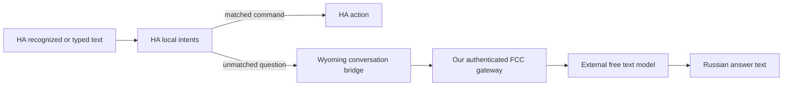

# FCC backup and Homeway switching

**FCC (`fcc-claude`) is the Homeway backup. Local Whisper and Piper are not required and are no longer part of the active deployment.** The user explicitly deferred local recognition on 2026-10-03. The dedicated authenticated FCC gateway and Wyoming conversation bridge stay running on the designated worker, each with one replica. The shared FCC installation and the existing Homeway selections are unchanged.

The verified backup capability is Russian **text conversation** through our FCC infrastructure to an external free model. Microphone audio transport and independent cloud speech synthesis still need a verified integration before this is a complete voice replacement for Homeway. Do not present a model catalog entry or a working text response as proof that the HTTP endpoint accepts audio.



The desired voice path is Echo → HA → cloud audio through the FCC integration → answer → Echo. Its missing audio transport must be implemented explicitly; there is no local inference model to warm or tune on the worker. HA local intents should remain preferred for supported household commands. The bridge has no HA token, home state, device tools, browsing, clock or conversation history and declares `supports_home_control=false`.

## Current scope and status

- `fcc-voice-gateway`: our isolated FCC service with an existing provider credential and its own proxy authentication.
- `fcc-voice-bridge`: a stateless Wyoming conversation endpoint forwarding text to FCC.
- Both remain resident with one replica on the designated worker. Model inference is upstream; the worker runs the gateway and adapter, not the model itself.
- Experimental `voice-backup-whisper` and `voice-backup-piper` Deployments are stopped (`replicas: 0`). Existing model PVCs are preserved; they are not part of the active recovery bundle and must not be automatically restored or deleted.
- The `FCC Russian Backup` HA pipeline now has no STT/TTS engine selected. Its conversation engine remains usable for text; voice switching is explicitly blocked until cloud speech is configured. Removing the old speech selections avoids relying on cached HA provider availability after stopping a service.
- Homeway remains the active assistant on reachable satellites. No automatic failover is configured.

The **138-second recognition measurement was local Whisper**, not FCC or Homeway cloud recognition. FCC text checks returned complete synthetic Russian answers in 1.82 seconds directly, 2.16 seconds through the Wyoming bridge and 8.28–8.68 seconds in HA Assist. After stopping local speech, HA conversation through FCC still returned a synthetic Russian answer in **2.354 seconds**. These are individual observations, not latency guarantees. Historical local speech diagnostics are retained in [the deferred experiment record](fcc-local-speech-experiment.md); they are not a tuning task or current deployment requirement.

## Audio boundary and model selection

The existing Homeway assistant uses Homeway cloud STT/TTS. Reusing those with the FCC conversation engine is a possible hybrid, but it remains dependent on Homeway and is not the independent backup requested here. No such hybrid was installed.

The inspected FCC HTTP routes accept `/v1/messages` and Responses-style text requests, without an HA audio-transcription endpoint or `input_audio` transport in the inbound message schema. **FCC already has a provider-owned NVIDIA NIM/Riva cloud audio backend**, currently wired to messaging voice notes. Its built-in Parakeet multilingual route supports Russian, and the operator already has an NVIDIA credential. That backend needs a bounded HA audio adapter and a synthetic account/latency check; answer synthesis also remains an integration gap. See the [existing backend and exact settings](fcc-audio-models.md#existing-fcc-cloud-audio-backend). No new provider account or local speech model is assumed. Do not launch local Whisper as an implicit fallback.

See [the catalog and audio route notes](fcc-audio-models.md). The supplied `~/fcc-models.txt` was inspected and left intact. The currently verified conversation route is:

```text
anthropic/open_router/liquid/lfm-2.5-2.6b:free
```

This route is text-only and currently has zero prompt/completion price. Its provider discloses prompt/output retention for training. The adjacent `no-thinking` alias failed with HTTP 400 because this endpoint requires reasoning; the bridge returns only final text. A Gemma free route returned HTTP 429 and is not configured as a fallback. Catalog names do not guarantee working transport, unlimited capacity or a free account allowance. Never substitute a paid route silently.

## Deploy and recover the FCC services

Implementation lives in [`integrations/fcc-voice-backup/`](../integrations/fcc-voice-backup/): the bridge, pinned dependencies/image, `k8s/gateway.yaml`, `k8s/bridge.yaml` and optional network policies. No speech model download, local Whisper/Piper deployment or model PVC is required for this active scope. The operator's `k3s-self-healing` repository owns the reviewed placement and recovery copy.

```bash
docker build -t fcc-voice-bridge:0.1.1 integrations/fcc-voice-backup
```

The bridge manifest uses `imagePullPolicy: Never`. Import the image into the selected node's Kubernetes/containerd image store, or deliberately use a private-registry immutable digest and corresponding pull policy. Workstation/NAS Docker storage is separate from k3s/containerd. Keep scheduling pinned to the node with the imported image.

Namespace `homeassistant` and Secret `fcc-voice-credentials` must exist. For an initial deployment only, obtain the existing provider credential through your private secret store and create a separate proxy token without putting either in command arguments:

```bash
umask 077
mkdir -p private
# Populate private/openrouter-api-key from the existing secret store first.
python3 -c 'import secrets; from pathlib import Path; Path("private/fcc-proxy-token").write_text(secrets.token_urlsafe(36))'
kubectl -n homeassistant create secret generic fcc-voice-credentials \
  --from-file=openrouter-api-key=private/openrouter-api-key \
  --from-file=proxy-token=private/fcc-proxy-token
```

Preserve existing credentials during recovery. The gateway reads both; the bridge mounts only the proxy token. The pinned FCC gateway uses Bearer authentication and empty `MODEL_FALLBACKS`. The bridge accepts explicit FCC OpenRouter `:free` IDs; that suffix is not a billing guarantee. The existing shared FCC deployment is untouched.

Apply only the reviewed gateway, bridge and accepted gateway-ingress policy with your private scheduling overlay. TCP readiness proves a listening process, not provider quota or complete voice capability. In HA, register the bridge through **Settings → Devices & services → Add integration → Wyoming Protocol**, host `fcc-voice-bridge.homeassistant.svc.cluster.local`, port `10400`. HA outside the cluster needs a private reachable address. The Echo connects to HA, not to cluster DNS directly.

All services are internal ClusterIP. Wyoming is unauthenticated. The gateway ingress policy was verified to allow bridge pods and deny an unrelated ordinary pod; missing proxy credentials were rejected. The optional bridge policy blocked the actual HA host-network path despite exact-source exceptions and is not deployed. Therefore bridge access trusts cluster clients and is not claimed to be network-isolated. Do not blindly apply `network-policy.yaml` in full or reintroduce a rejected bridge policy during recovery. No public Ingress or NodePort is required.

## Switch one or several satellites


**Voice switching is gated until independent cloud speech is configured and verified.** The current FCC conversation works with text, but the retired local speech providers must not be selected. The CLI intentionally refuses a voice switch when an STT/TTS engine is missing or unavailable. The following is the prepared workflow for a complete pipeline.

The simple UI route is each satellite's **Assistant** select: choose **FCC Russian Backup** to use the standby, or the existing Homeway assistant to return. Choosing HA's global preferred pipeline alone does not override a satellite with an explicit assistant selection. No APK reinstall, firmware update, wake-word retraining or USB connection is needed.

For repeatable switching use [`scripts/voice_pipeline.py`](../scripts/voice_pipeline.py). Use Python 3.11 with `aiohttp` installed; the bridge requirements provide a tested version:

```bash
python3.11 -m venv private/voice-tools
private/voice-tools/bin/pip install -r integrations/fcc-voice-backup/requirements.txt
cp templates/home-assistant/voice-backends.example.json private/voice-backends.json
chmod 600 private/voice-backends.json
```

Fill the private mapping with the two exact existing pipeline IDs **or** unique names and only the intended satellites' `select.*_assistant` entities. Remove unused example selectors. Do not include a disconnected device in a group switch: unavailable selectors are rejected before any write. Keep a separate mapping for an offline device and switch it after reconnecting. Identical pipeline names are ambiguous and refused.

Set `HA_URL` to your reachable HA origin and exactly one credential source: `HA_TOKEN_FILE` pointing to a private token file, or `HA_TOKEN` supplied by your secret manager. Avoid putting credentials in shell history. The script requires all mapping/snapshot files beneath this repository's ignored `private/` directory. Use the same HA origin for switching and restoring; snapshots are bound to its fingerprint.

```bash
# Inspect health and the number of mapped satellites. No writes.
private/voice-tools/bin/python scripts/voice_pipeline.py \
  --mapping private/voice-backends.json status

# Preview Homeway → FCC. Dry run is the default.
private/voice-tools/bin/python scripts/voice_pipeline.py \
  --mapping private/voice-backends.json switch --backend fcc

# Apply the reviewed switch and preserve the previous selections.
private/voice-tools/bin/python scripts/voice_pipeline.py \
  --mapping private/voice-backends.json switch --backend fcc \
  --apply --snapshot private/switch-to-fcc.json

# Return to Homeway, with another snapshot.
private/voice-tools/bin/python scripts/voice_pipeline.py \
  --mapping private/voice-backends.json switch --backend homeway \
  --apply --snapshot private/switch-to-homeway.json

# Alternatively preview, then restore the exact previous selections.
private/voice-tools/bin/python scripts/voice_pipeline.py \
  restore --snapshot private/switch-to-fcc.json
private/voice-tools/bin/python scripts/voice_pipeline.py \
  restore --snapshot private/switch-to-fcc.json --apply
```

Use a new snapshot filename for each operation; existing files are not overwritten. Add `--include-default` only when you deliberately want to change HA's global preferred pipeline as well. Restoring such a global change also requires that flag. Ordinary satellite-only switching leaves the global preference alone.

`status` reports registered HA engine availability, not provider quota or a successful acoustic test. The script checks target engines, selector options and readback, writes a mode-0600 journal before changing anything, and refuses observable external changes. Partial rollback only touches confirmed writes whose current state still matches the recorded result. HA has no atomic compare-and-set API: stop competing automations while switching. An interrupted request can leave an uncertain outcome; inspect the private journal and HA before trying again. Do not claim transaction-level isolation or blindly replay voice commands after an error.

There is **no automatic failover**. It would need separate design for duplicate actions, provider/privacy changes and recovery. The prepared manual switch is deliberate and reversible.

## Limits and acceptance

The bridge allows one in-flight question, a 30-second FCC deadline, 2,000 input characters, a 1,024-token generation budget, a 256 KiB upstream response and 4,000 final answer characters. It sends no prior turns, does not retry requests, and rejects unfinished/tool responses. Overlapping questions get a busy error. Provider routing/retries and account quotas are separate.

Check current free-model allowance through OpenRouter's authenticated `/api/v1/key`; absent counters mean unknown, not unlimited. Other account traffic shares the allowance. [OpenRouter limits](https://openrouter.ai/docs/api-reference/limits).

Before completing the voice backup:

1. Verify the FCC conversation returns a bounded synthetic Russian response through HA. Test a harmless local HA intent separately.
2. Verify a Russian cloud audio route available to our FCC installation, its actual transport and credential/quota requirements. Do not deploy local Whisper/Piper implicitly.
3. Add and test the HA audio adapter and answer-synthesis route. Use only synthetic recordings for unattended tests. Confirm neither depends on Homeway before calling it an independent backup.
4. Update the FCC Assist pipeline's STT/TTS engines only after that route works. Run synthetic end-to-end recognition, conversation and answer-audio checks, including timeout/quota errors.
5. Switch one attended satellite, test the existing wake phrase, microphone and speaker, then return to Homeway. Expand only after acceptable latency and reliability.

No household audio has been uploaded for these experiments. Keep raw provider responses, recordings, tokens, account counters and filled deployment mappings in ignored `private/`. Source catalog, downloaded model caches and temporary evidence do not belong in Git.
