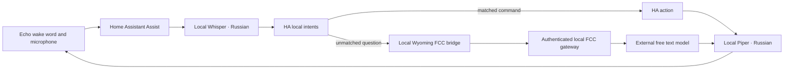

# FCC voice backup and Homeway switching

This optional standby keeps the wake word and Echo apps unchanged. It adds a separate Russian Assist pipeline: local Whisper speech recognition, HA local intents, an FCC text conversation bridge, and local Piper speech synthesis. Homeway remains installed and selected until the operator explicitly switches a satellite.

**Current acceptance status (2026-10-03):** all four services are deployed continuously on the designated standby worker and the Russian speech roundtrip is correct, but the warm sample took **25.094 seconds for TTS and 137.945 seconds for STT**. This is not accepted for interactive voice use. Homeway remains primary. Do not mistake loaded HA entities or Kubernetes Ready for an acceptable response time. The operator explicitly chose to keep the services resident on that worker; they were not moved to the HA server.



Audio is processed by the operator-controlled HA/Whisper/Piper infrastructure in this route, which may include privately managed cloud nodes. Unmatched recognized text is sent through the local FCC gateway to an external model provider. This is **independent of Homeway, but not fully offline AI**. Ordinary HA commands that match the local intent recognizer do not need the external model. The fallback model has no HA access token, home state, device tools, browsing, clock, or conversation history. It cannot reproduce Sage's memories or arbitrary tool-based home control. Supported device commands depend on HA's exposed entities and Russian sentences.

The bridge deliberately declares `supports_home_control=false`. Keep **Prefer handling commands locally** enabled in this pipeline. A question that needs current information must not be treated as evidence of live weather, device state or a completed action.

## Where recognition runs

The existing **Homeway** pipeline uses Homeway's cloud STT and TTS. The **137.945-second** measurement belongs to the new **local Whisper on the standby worker**, not Homeway or the cloud text model. FCC receives a transcript in the deployed standby; it does not receive the microphone audio. These are separate recognition, conversation and synthesis stages.

A possible hybrid pipeline can retain Homeway STT/TTS and select the FCC conversation agent. It would bypass the local speech bottleneck but would still depend on Homeway, so it is not an independent outage backup. This hybrid has not been deployed or benchmarked. Independently hosted cloud recognition, such as Groq's multilingual `whisper-large-v3-turbo`, needs its own audio adapter, credential and verified free-tier allowance. Its audio endpoint is separate from FCC chat; this option is not yet implemented. See the [route and model notes](fcc-audio-models.md). Keep the existing Homeway selections until the chosen replacement passes end-to-end acceptance.

## Models and the supplied catalog

The supplied `~/fcc-models.txt` was inspected without modifying it. It is a discovery snapshot, not a guarantee of free access, audio support or a working API route. See [the audio/model shortlist](fcc-audio-models.md) for exact catalog IDs, current upstream capabilities and exclusions.

The selected and synthetically verified text route is:

```text
anthropic/open_router/liquid/lfm-2.5-2.6b:free
```

It is text-only. Whisper handles the actual audio. Its free provider discloses that prompts and outputs may be retained for training; decide whether that is appropriate before using household questions. The alternative shortlisted free text route is `claude-3-freecc-no-thinking/open_router/google/gemma-4-26b-a4b-it:free`. Current route success and latency must be checked on the actual account. The normal `anthropic/` alias succeeded in 1.82 seconds for one synthetic Russian question. The `no-thinking` Liquid alias failed with HTTP 400 because the provider requires reasoning; the bridge removes reasoning blocks from the spoken answer. Gemma returned upstream HTTP 429 in the same session and is not configured as a fallback. Neither the FCC prefix nor the catalog implies unlimited quota.

FCC's inspected HTTP interface accepts Anthropic-style `/v1/messages` and Responses-style requests, but does not provide `/v1/audio/transcriptions` or pass `input_audio` through its typed message schema. Selecting an audio-capable model name does not add audio transport. FCC's separate messaging voice-note helper is not an HA speech endpoint; the inspected helper also forces English recognition. This implementation uses the standard [Wyoming protocol](https://github.com/OHF-Voice/wyoming) instead.

## Components and deployment

Public implementation lives in [`integrations/fcc-voice-backup/`](../integrations/fcc-voice-backup/):

- `bridge.py`: a stateless Wyoming conversation service translating a transcript into one FCC `/v1/messages` request. No tools, subprocesses or HA credentials.
- `Dockerfile` and `requirements.txt`: Python 3.11 image and pinned direct dependencies.
- `k8s/speech.yaml`: official digest-pinned [Wyoming Whisper](https://github.com/OHF-Voice/wyoming-faster-whisper) and [Piper](https://github.com/OHF-Voice/wyoming-piper) images, persistent model caches and resource limits. Whisper uses multilingual `base-int8` weights with `float32` compute, Russian, two CPU threads, one OpenBLAS/MKL thread, passive OpenMP waiting and beam size one; Piper uses `ru_RU-irina-medium`.
- `k8s/gateway.yaml`: an isolated FCC instance with its own provider configuration and proxy authentication. It does not change another FCC deployment or its default model.
- `k8s/bridge.yaml`: the bridge Deployment and internal ClusterIP Service.
- `k8s/network-policy.yaml`: ingress isolation for the bridge and gateway. See the host-network note below before applying.

The manifests use namespace `homeassistant`; they do not create it. All four services run continuously with one replica; there is no scale-to-zero or idle shutdown. Whisper preloads its configured transcriber and Piper retains its most recently used voice, so normal requests reuse resident models after the first synthesis. Persistent model caches also avoid downloads on ordinary restarts. Choose a CPU node with enough spare memory in a private scheduling overlay. The speech services reserve 1.1 CPU / 1.125 GiB and allow up to 3 CPU / 3.5 GiB in total. Piper uses an image-specific startup adapter in a ConfigMap to limit ONNX intra/inter-op threads to one and disable spinning; default ONNX threading caused a 60-second synthesis timeout under a one-CPU container quota. Whisper also limits BLAS threads separately from CTranslate2; beam one trades some decoding accuracy for shorter-command latency. Revalidate the adapter if changing the pinned image. Initial image/model downloads can take several minutes. Models stay on the two PVCs; deleting the Deployments does not delete those caches. Local-volume scheduling must follow the node holding the PVCs.

Build the bridge for the cluster's architecture:

```bash
docker build -t fcc-voice-bridge:0.1.1 integrations/fcc-voice-backup
```

The supplied bridge manifest uses `imagePullPolicy: Never` for an explicitly imported local image. Import that exact image into every eligible node's Kubernetes container runtime, or replace the image with your private registry's immutable digest and use an appropriate pull policy. An image existing in workstation/NAS Docker is not automatically present in k3s/containerd. Pin the Deployment to the node where you imported it if only one node has the image.

Create the credentials from private files, never literal command-line values. Obtain the OpenRouter key through your existing secret store, write it to `private/openrouter-api-key` with mode 0600, and create a separate random proxy token. Do not copy the provider key to the bridge or to HA.

```bash
umask 077
mkdir -p private
python3 -c 'import secrets; from pathlib import Path; Path("private/fcc-proxy-token").write_text(secrets.token_urlsafe(36))'
kubectl -n homeassistant create secret generic fcc-voice-credentials \
  --from-file=openrouter-api-key=private/openrouter-api-key \
  --from-file=proxy-token=private/fcc-proxy-token
```

The gateway reads both credentials; the bridge mounts only the proxy token. The pinned FCC image uses Bearer proxy authentication. `MODEL_FALLBACKS` is empty to prevent an unavailable free model from silently selecting a different or paid model. The bridge requires an explicit `anthropic/open_router/...:free` or `claude-3-freecc-no-thinking/open_router/...:free` ID. Recheck provider pricing before changing it; suffix validation is not a billing guarantee. This deployment uses no paid plugins or model fallback list.

Apply private overlays for scheduling and network access, then the speech, gateway and bridge resources. Wait for readiness before registering them with HA. A TCP readiness probe proves a listening socket, not that the external provider has quota; run a synthetic conversation check too.

**Network access:** Wyoming itself has no authentication. Do not expose ports 10200, 10300 or 10400 through a public Ingress/NodePort. The bridge policy allows the HA pod selector, and the gateway policy allows only bridge pods. For HA using `hostNetwork: true`, a pod selector alone is insufficient: add the verified source address observed at the bridge as an exact `/32` (`/128` for IPv6) to the bridge ingress in a private overlay. Host-to-Service traffic can be SNATed to a node/CNI address, so HA's reported hostIP may be the wrong peer. Verify your CNI actually enforces the policy and that an unrelated ordinary pod remains denied. A post-SNAT rule permits all traffic sharing that source, not a uniquely identifiable HA process. Policies are additive; another broad allow policy can widen access. Speech endpoints should also remain restricted to the trusted infrastructure network.

**Deployed host-network limitation:** the gateway ingress policy was verified (bridge allowed; an unrelated ordinary pod denied; missing proxy token rejected). The bridge policy blocked the actual HA host-network path despite two exact-source rules, so it was removed from the running standby. The bridge remains an internal ClusterIP and is reachable by trusted cluster clients; network isolation of its unauthenticated Wyoming port is **not** claimed. Do not blindly apply the public bridge policy or a rejected private overlay to this installation. Resolve the CNI/SNAT path in a separate bounded change before treating it as isolated from untrusted cluster workloads.

## Register the standby in Home Assistant

In **Settings → Devices & services → Add integration → Wyoming Protocol**, register these internal services from an HA instance that can resolve cluster DNS:

- Whisper: `voice-backup-whisper.homeassistant.svc.cluster.local`, port `10300`.
- Piper: `voice-backup-piper.homeassistant.svc.cluster.local`, port `10200`.
- FCC conversation: `fcc-voice-bridge.homeassistant.svc.cluster.local`, port `10400`.

An HA installation outside Kubernetes needs private reachable addresses instead. Do not paste cluster DNS into an Echo app: the Echo connects to HA, and HA connects to these providers.

Create **FCC Russian Backup** in **Settings → Voice assistants**. Select Russian, the new FCC conversation agent, the new Whisper STT provider and the new Piper TTS provider/Irina voice. Enable local intent handling. Keep the existing Homeway pipeline and preferred assistant unchanged during preparation. Adding these providers does not require an HA restart.

## Switch one or several satellites

The simple UI route is each satellite's **Assistant** select: choose **FCC Russian Backup** to use the standby, or the existing Homeway assistant to return. Choosing HA's global preferred pipeline alone does not override a satellite with an explicit assistant selection. No APK reinstall, firmware update, wake-word retraining or USB connection is needed.

For repeatable switching use [`scripts/voice_pipeline.py`](../scripts/voice_pipeline.py). Use Python 3.11 with `aiohttp` installed; the bridge requirements provide a tested version:

```bash
python3.11 -m venv private/voice-tools
private/voice-tools/bin/pip install -r integrations/fcc-voice-backup/requirements.txt
cp templates/home-assistant/voice-backends.example.json private/voice-backends.json
chmod 600 private/voice-backends.json
```

Fill the private mapping with the two exact existing pipeline IDs **or** unique names and only the intended satellites' `select.*_assistant` entities. Remove unused example selectors. Do not include a disconnected device in a group switch: unavailable selectors are rejected before any write. Keep a separate mapping for an offline device and switch it after reconnecting. Identical pipeline names are ambiguous and refused.

Set `HA_URL` to your reachable HA origin and exactly one credential source: `HA_TOKEN_FILE` pointing to a private token file, or `HA_TOKEN` supplied by your secret manager. Avoid putting credentials in shell history. The script requires all mapping/snapshot files beneath this repository's ignored `private/` directory. Use the same HA origin for switching and restoring; snapshots are bound to its fingerprint.

```bash
# Inspect health and the number of mapped satellites. No writes.
private/voice-tools/bin/python scripts/voice_pipeline.py \
  --mapping private/voice-backends.json status

# Preview Homeway → FCC. Dry run is the default.
private/voice-tools/bin/python scripts/voice_pipeline.py \
  --mapping private/voice-backends.json switch --backend fcc

# Apply the reviewed switch and preserve the previous selections.
private/voice-tools/bin/python scripts/voice_pipeline.py \
  --mapping private/voice-backends.json switch --backend fcc \
  --apply --snapshot private/switch-to-fcc.json

# Return to Homeway, with another snapshot.
private/voice-tools/bin/python scripts/voice_pipeline.py \
  --mapping private/voice-backends.json switch --backend homeway \
  --apply --snapshot private/switch-to-homeway.json

# Alternatively preview, then restore the exact previous selections.
private/voice-tools/bin/python scripts/voice_pipeline.py \
  restore --snapshot private/switch-to-fcc.json
private/voice-tools/bin/python scripts/voice_pipeline.py \
  restore --snapshot private/switch-to-fcc.json --apply
```

Use a new snapshot filename for each operation; existing files are not overwritten. Add `--include-default` only when you deliberately want to change HA's global preferred pipeline as well. Restoring such a global change also requires that flag. Ordinary satellite-only switching leaves the global preference alone.

`status` reports registered HA engine availability, not provider quota or a successful acoustic test. The script checks target engines, selector options and readback, writes a mode-0600 journal before changing anything, and refuses observable external changes. Partial rollback only touches confirmed writes whose current state still matches the recorded result. HA has no atomic compare-and-set API: stop competing automations while switching. An interrupted request can leave an uncertain outcome; inspect the private journal and HA before trying again. Do not claim transaction-level isolation or blindly replay voice commands after an error.

There is **no automatic failover**. It would need separate design for duplicate actions, provider/privacy changes and recovery. The prepared manual switch is deliberate and reversible.

## Limits and acceptance

The bridge allows one in-flight question, a 30-second FCC deadline, 2,000 input characters, a 1,024-token generation budget, a 256 KiB upstream response and 4,000 final answer characters. It sends no prior turns, does not retry requests, and rejects unfinished/tool responses. Provider-side routing/retry behavior is separate. Overlapping questions get a busy error rather than a queue of stale commands. These are bridge limits, not the model's published context size or HA's audio limits.

Free provider quotas are account dependent. Use OpenRouter's authenticated `/api/v1/key` to inspect the current free-model daily counter/ceiling where reported; a missing field is unknown, not unlimited. Shared account traffic consumes the same allowance. A healthy local FCC process does not prove free-model capacity. [OpenRouter limit documentation](https://openrouter.ai/docs/api-reference/limits).

Before selecting the standby for daily use:

1. Verify all three Wyoming integrations are loaded and the FCC agent is not advertised as a home-control agent.
2. Use a synthetic Russian sentence to test Piper → Whisper, then an Assist run through STT → FCC → TTS. Fetch the generated answer audio without playing it on a household device.
3. Test a harmless local HA intent separately and confirm it avoids the external model.
4. Switch one attended satellite, say the existing wake phrase, ask a short question, then return to Homeway and repeat. Check physical audibility and microphone recovery after calls.
5. Check concurrent-device behavior, a provider timeout/quota error, restart recovery and longer-term reliability before expanding the scope.

Keep recordings, transcripts, provider responses, endpoints, account counters and filled mappings in `private/`. Public documentation should contain only synthetic test results and aggregate timings. The source catalog and downloaded models are not added to Git.

## Deployment evidence, 2026-10-03

The dedicated FCC gateway uses the pinned 5.14.0 image; the separate workstation installation inspected for audio support was 5.15.2. The existing shared FCC deployment was left unchanged. Its missing OpenRouter credential was one reason to isolate the voice configuration instead of modifying the shared service.

The actual normal Liquid alias returned a complete Russian answer in 1.82 seconds through FCC HTTP. A subsequent HA-host → Wyoming bridge → FCC → model roundtrip returned a final answer in 2.16 seconds with bridge version 0.1.1. An HA Assist text run later took 8.28 seconds through the same FCC agent, while a local “what time is it?” intent took 0.004 seconds. These are individual synthetic observations, not latency percentiles or an availability guarantee. The no-thinking alias failed with a mandatory-reasoning HTTP400; Gemma returned upstream capacity HTTP429. No paid model fallback was enabled.

The new conversation entity advertises zero home-control features. A separate `FCC Russian Backup` pipeline was created with local-intent preference; the original pipelines, global preference and all four inventoried satellite selections were preserved. Guarded switching previews passed for the second Show and the three reachable assistant selectors together. The disconnected first Show has its own mapping for later use.

Gateway access/authentication and the bridge ingress-isolation limitation are recorded above. Physical wake-word response, microphone capture, speaker quality and long-term stability remain separate attended acceptance checks.

The speech-only acceptance used a generated 2.519-second Russian phrase and returned the exact normalized transcript. The warm run took 25.094 seconds for synthesis and 137.945 seconds for recognition; the first base-model decode took about 139.3 seconds. Models remained resident in the same processes, so cold loading does not explain the steady-state delay. Earlier Small-model runs also exceeded the 90-second client deadline. Base fits the configured resource budget but has not met the latency gate.

A subsequent complete synthetic Assist run used a 2.011-second recording of “Почему лёд плавает в воде?”. STT finished at 136.354 seconds from run start but misrecognized “лёд” as “лет”; this is distinct from the earlier exact short-phrase result. The FCC conversation stage took 8.682 seconds. HA reported `run-end` at 145.038 seconds with a TTS URL, but the first answer-audio byte arrived only at 192.427 seconds and the complete 11.624-second answer recording was downloaded at 221.019 seconds. This proves the protocol path completed, not acceptable recognition or interactive performance. The benchmark used a test-only 300-second pipeline deadline; production deadlines were not extended. A separate local time intent completed its text path in 0.0035 seconds, with first generated audio at 13.407 seconds. No audio was played on household devices.

Read-only host diagnostics found 94.7% guest CPU utilization, CPU pressure around 69–74% and load around 60 on 16 virtual CPUs while the speech services were idle. Batch video encoding and provisioning work were active. Ancestor cgroups had no hidden CPU quota; accumulated speech-container throttling was under 2 seconds and does not by itself explain the measured delay. The worker CPU also lacks AVX2/FMA. These observations establish contention and limited CPU features, not a single proven cause of every slow request. The physical host was unreachable during the audit, so host swapping/hypervisor limits remain unverified.

Keep models resident and repeat a bounded warm acceptance during a coordinated lower-load window before enabling this as an everyday fallback. Do not restart HA, repeatedly restart speech workers, delete whole PVCs or pause unrelated workloads automatically to make a latency check pass. One interrupted Base download left a partial HuggingFace snapshot missing `model.bin`; only that incomplete re-downloadable model cache was removed, preserving the PVC and other model caches. Repair a partial cache only after verifying the failure and stopping that worker's download activity.
